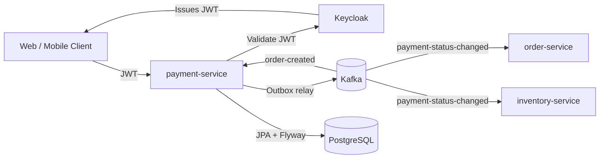
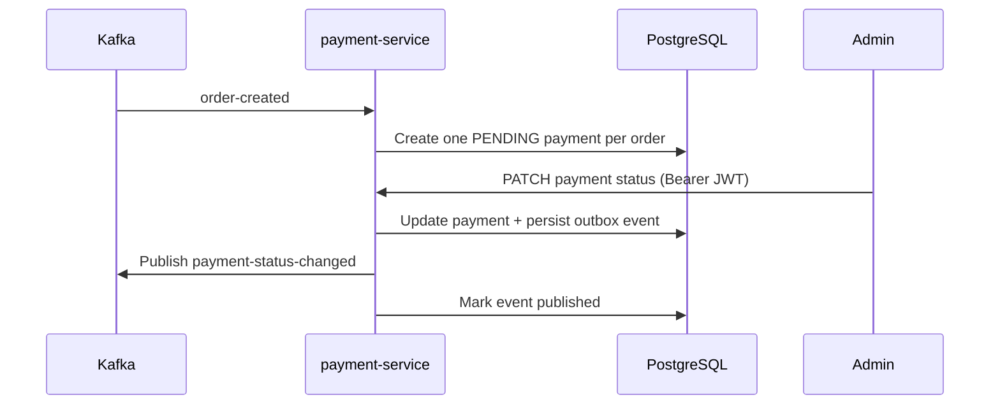
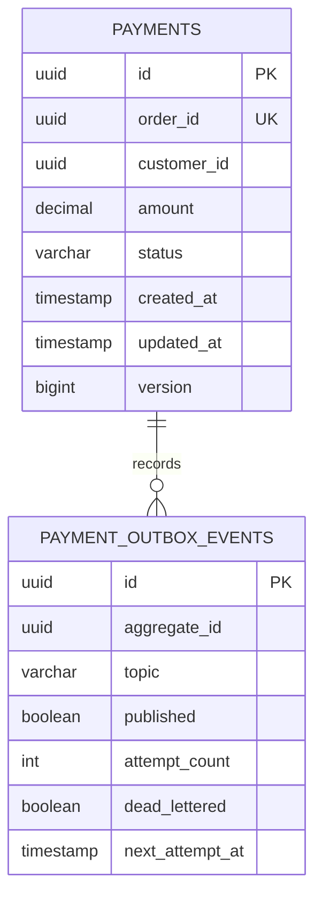
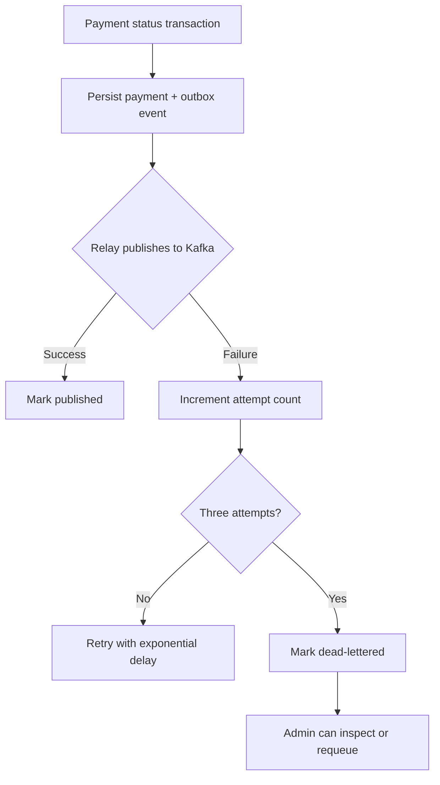

# SpareLink Payment Service

[](https://github.com/tadiwanashe-mashongwa/payment-service/actions/workflows/ci.yml)
[](https://github.com/tadiwanashe-mashongwa/payment-service/actions/workflows/ci.yml)
[](https://openjdk.org/projects/jdk/17/)
[](https://spring.io/projects/spring-boot)

The Payment Service owns the payment lifecycle for SpareLink orders. It creates one payment per order, publishes payment status changes, and never shares its database with another service.

## Responsibilities

- Consumes `order-created` events from Kafka and creates a `PENDING` payment.
- Enforces one payment per order at both service and database levels.
- Manages valid payment transitions: `PENDING` to `SUCCESS` or `FAILED`, and `SUCCESS` to `REFUNDED`.
- Reliably publishes `payment-status-changed` through a transactional outbox relay.
- Secures payment APIs with Keycloak-issued JWTs.

## Stack

Java 17, Spring Boot 3.5.5, PostgreSQL, JPA/Hibernate, Flyway, Kafka, Spring Security OAuth2 Resource Server, OpenAPI, Testcontainers, and Docker.

## Architecture



## Payment flow



## Database model



## Run locally

Run the complete SpareLink stack from the platform repository:

```powershell
docker compose up --build -d
```

Payment Service is exposed at `http://localhost:8084`.

| Resource | URL |
| --- | --- |
| Health | `http://localhost:8084/actuator/health` |
| OpenAPI JSON | `http://localhost:8084/v3/api-docs` |
| Swagger UI | `http://localhost:8084/swagger-ui/index.html` |

## Security

The service validates JWTs from the configured Keycloak realm. Set `KEYCLOAK_ISSUER_URI` when running outside the platform Docker network.

| Endpoint | Access |
| --- | --- |
| `GET /actuator/health`, OpenAPI and Swagger UI | Public |
| `GET /api/payments/**` | `CUSTOMER` or `ADMIN` |
| `POST`/`PATCH /api/payments/**` | `ADMIN` |

## API

| Method | Endpoint | Purpose |
| --- | --- | --- |
| `POST` | `/api/payments` | Create a payment |
| `GET` | `/api/payments/{paymentId}` | Get a payment |
| `GET` | `/api/payments/customer/{customerId}` | List customer payments with pagination |
| `PATCH` | `/api/payments/{paymentId}/status` | Transition payment status |
| `GET` | `/api/payment-outbox/dead-lettered` | List dead-lettered events (ADMIN) |
| `POST` | `/api/payment-outbox/{eventId}/requeue` | Requeue an event (ADMIN) |

Use Swagger UI for the generated request and response schemas.

## Events

| Direction | Topic | Event |
| --- | --- | --- |
| Consumed | `order-created` | `OrderCreatedEvent` |
| Published | `payment-status-changed` | `PaymentStatusChangedEvent` |

## Reliability: transactional outbox



## Tests

```powershell
mvn test
```

The suite covers domain transitions, service behaviour, controller and security rules, Flyway/JPA repository behaviour, Kafka consumption, and outbox publishing. Testcontainers provides real PostgreSQL and Kafka where integration coverage requires them.

The JaCoCo HTML report is generated at `target/site/jacoco/index.html`.

## Project structure

```text
src/main/java/com/example/paymentservice
├── controller      HTTP API
├── service         payment and outbox use cases
├── entity          payment domain model
├── outbox          reliable event delivery
├── consumer        order-created Kafka consumer
├── config          security configuration
└── exception       ProblemDetail error handling
```
